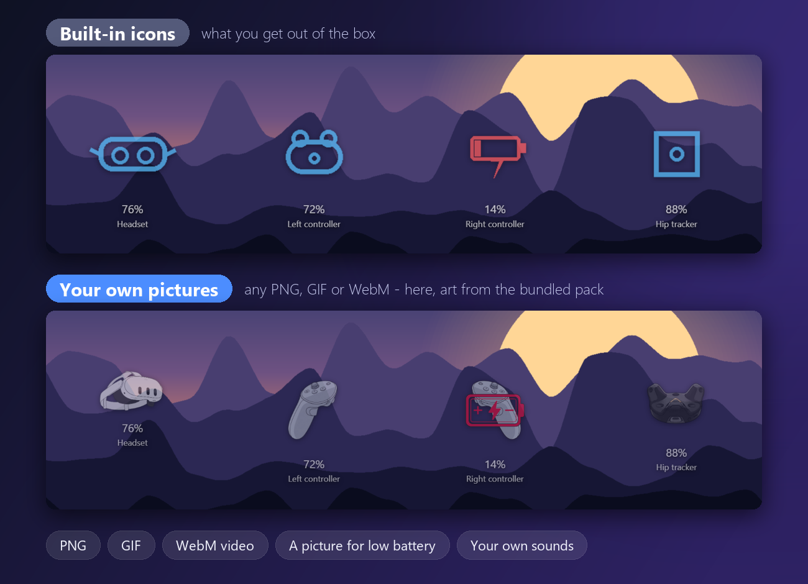

<div align="center">


*Ein SteamVR-Akku-Overlay für OBS - damit der Chat dich endlich erinnern kann.*

[](https://github.com/Jayconius/OhFudgeMyBatteryChat/releases/latest)
[](#)
[](#)
[](LICENSE)

🌐 [English](README.md) | **Deutsch** | [Français](README.fr.md) | [Español](README.es.md) | [日本語](README.ja.md)

</div>

---

## ✨ Was ist das?

Headset, Controller und Tracker zeigen ihren **Akkustand live im Stream**, und eine **Warnung erscheint**, sobald etwas knapp wird. Es ist eine normale OBS-Browserquelle - in OBS muss nichts installiert werden.

<p align="center"></p>

> [!TIP]
> **Kein Streamer?** Du brauchst OBS gar nicht. Klicke in der App auf **Im Browser öffnen** und nutze es als persönlichen Akku-Alarm.

## 📥 Download

| | |
|---|---|
| 💿 **[Oh Fudge, My Battery Chat!](https://github.com/Jayconius/OhFudgeMyBatteryChat/releases/latest)** | Die App. Eine einzelne exe, nichts zu installieren. |
| 🎙️ **[Oh Fudge VR Macro App](https://github.com/Jayconius/OhFudgeMyBatteryChat/releases/tag/macros-v1.0.0)** | Optional. Große Stummschalt-Tasten in einem kleinen Fenster, das du in VR anheften kannst. |
| 🧪 **[Demo Simulator](https://github.com/Jayconius/OhFudgeMyBatteryChat/releases/tag/simulator-v2.0.0)** | Optional. Gefälschte Geräte und Mikrofone zum Ausprobieren ohne Headset. |

> [!NOTE]
> Die exe-Dateien sind nicht signiert, daher meldet Windows SmartScreen evtl. *"Unbekannter Herausgeber"*. Klicke auf **Weitere Informationen → Trotzdem ausführen**.

## 🚀 Schnellstart

1. **Starte die App** bei bereits geöffnetem SteamVR. Deine Geräte erscheinen links.
2. **Klicke auf Hinzufügen**, um eine Akkuanzeige (*Gerät hinzufügen*) oder eine Warnung (*Overlay-Effekt hinzufügen*) anzulegen, und zieh sie an die gewünschte Stelle. Per Doppelklick auf eine Zeile bearbeitest du sie später.
3. **Kopiere die URL** oben in OBS als **Browserquelle** (Größe 1920x1080). Fertig!

<p align="center"></p>

## 🎛️ Was kann es?

| | |
|---|---|
| 🔋 **Live-Akkustand** | Für jedes SteamVR-Gerät: Headset, Controller, Tracker. Eigene Bilder, GIFs oder Videos - oder das mitgelieferte Grafikpaket. |
| 🚨 **Akku-Warnungen** | Erscheinen, wenn ein Gerät unter deinen Wert fällt, mit Ton. Nudge-Gruppen reihen mehrere Warnungen auf, damit sie sich nie überlappen. |
| ⚡ **Laden** | Ein Bild, während geladen wird, plus eine Warnung, wenn der Akku trotz Ladegerät weiter sinkt. |
| 🎬 **Overlay-Effekte** | Eigenständige Einblendungen für: Akku niedrig / normal, Gerät verbunden / getrennt, Laden, Tracking verloren und Headset abgenommen *(experimentell)*. |
| 💜 **Twitch-Chat-Befehle** | Lass den Chat eine Warnung mit einem Befehl wie `!battery` auslösen - für alle, VIPs oder Mods. |
| 🎙️ **Mikrofone** *(experimentell)* | Warnungen für ein Funkmikrofon: verbunden, getrennt, stumm, spricht, still. |
| 🔘 **Stummschalt-Makros** *(experimentell)* | Ein Mikro per globalem Tastenkürzel oder großer Schaltfläche stummschalten, aktivieren oder umschalten. |
| 🧩 **Sync-Gruppen** | Geräte, die gemeinsam als Set erscheinen, sobald alle bereit sind. |
| 🎨 **Ganz nach deinem Geschmack** | Schriftarten, Farben, Konturen, Wackeln / Schütteln / Pulsieren, dunkles oder helles Design. |
| 🌍 **Sprachen** | English, Deutsch, Français, Español, 日本語 und Klingonisch. |

## 🖼️ Eigene Bilder verwenden

Jedes Gerät und jede Warnung kann **dein eigenes Bild, GIF oder WebM-Video** und einen eigenen **Ton** nutzen. Lässt du eine Stelle leer, wird das eingebaute Symbol verwendet. Die App bringt außerdem ein Paket illustrierter Headset-, Controller- und Tracker-Grafiken zum Auswählen mit (das ist die zweite Reihe im Bild).

<p align="center"></p>

1. Öffne **Gerät hinzufügen** (oder bearbeite ein Gerät per Doppelklick in der Liste).
2. Klicke im Bereich **Medien** neben **Normalbild:** auf **Auswählen...**. Es öffnet das mitgelieferte Grafikpaket, oder du suchst deine eigene Datei.
3. Wähle auch ein **Bild bei niedrigem Akku:**, wenn sich das Bild bei niedrigem Akku ändern soll, und einen **Warnton:** für die Warnung.
4. Klicke auf **Speichern**. Das Overlay in OBS aktualisiert sich von selbst.

Warnungen (**Overlay-Effekt hinzufügen**) funktionieren genauso: Wähle ein **Bild:** und einen Ton. Grafikpaket verloren? **ℹ Info > Symbole wiederherstellen** bringt es zurück.

## 🧰 Alles in drei Fenstern

Die ganze Einrichtung passiert in drei einfachen Fenstern: **Gerät hinzufügen** (eine Live-Akkuanzeige), **Overlay-Effekt hinzufügen** (eine Warnung) und **Makros** (Stummschalt-Tasten und Tastenkürzel). Klicke auf das Bild, um es größer zu sehen. Es zeigt die englische Oberfläche.

<p align="center"><a href="docs/images/settings.png"></a></p>

## 🎙️ Stummschalt-Makros und die VR Macro App

*Neu (experimentell)*

1. Klicke oben rechts auf **Makros**, dann auf **Hinzufügen**: wähle ein Mikrofon, was das Makro tut (stummschalten, aktivieren oder umschalten) und optional ein **globales Tastenkürzel** wie `STRG+UMSCHALT+NUM5`. Es funktioniert auch, wenn ein Spiel im Vordergrund ist.
2. Für große Schaltflächen klicke im selben Fenster auf **Oh Fudge VR Macro App öffnen**. Liegt sie noch nicht im Ordner der App, bietet die App den Download an - erst nach deinem Klick auf Ja, und sie wird nur behalten, wenn die Prüfsumme mit der von GitHub übereinstimmt.
3. Jedes Makro ist eine Schaltfläche mit **LIVE**, **MUTED** oder **OFFLINE**. Zunächst ist sie gesperrt, damit nichts versehentlich verrutscht: **Rechtsklick > Edit layout** zum Verschieben, Skalieren und Umfärben, dann **Done**.
4. Hefte das Fenster in VR mit **OVR Toolkit, XSOverlay oder Desktop+** an. Es nimmt deinem Spiel nie den Fokus.

Makros ändern die Windows-Stummschaltung. Die Stummtaste eines Funkmikrofons selbst sieht Windows meist nicht - nutze ein Makro (oder die Windows-Stummschaltung), damit die Warnung **Mikro stumm** reagiert.

<p align="center"></p>

## 🧪 Ausprobieren ohne Headset

Hol dir den [Demo-Simulator](https://github.com/Jayconius/OhFudgeMyBatteryChat/releases/tag/simulator-v2.0.0) und lege `OhFudgeMyBatteryChatSimulator.exe` in **denselben Ordner** wie `OhFudgeMyBatteryChat.exe`. Starte beide: Die App zeigt die gefälschten Geräte und Mikrofone des Simulators, jeweils mit Reglern und Kontrollkästchen. Schließe den Simulator, um zu deinen echten Geräten zurückzukehren.

## 📖 Anleitungen

<details>
<summary><b>OBS-Browserquelle hinzufügen</b></summary>

<br>

1. In OBS: **Quellen > + > Browser**, benennen, OK.
2. Füge die URL von oben in der App ein (Standard `http://127.0.0.1:8710/overlay`).
3. Setze **Breite** `1920` und **Höhe** `1080`. Positionen skalieren auf jede Leinwand, Größen sind aber auf 1920x1080 abgestimmt.
4. Lass **"Quelle beenden, wenn nicht sichtbar"** ausgeschaltet, damit Warnungen auch bei nicht sichtbarer Szene funktionieren.
5. Kein Ton? Aktiviere bei dieser Quelle **"Audio über OBS steuern"**.

Danach bleibt sie von selbst synchron: Hinzufügen, Ändern oder Entfernen aktualisiert die Browserquelle in etwa einer Sekunde.

</details>

<details>
<summary><b>Ein Gerät hinzufügen (eine Live-Akkuanzeige)</b></summary>

<br>

1. Klicke auf **Hinzufügen > Gerät hinzufügen**.
2. Wähle links das Gerät (fehlt es, klicke auf **Aktualisieren**). Mit **"Bereits hinzugefügte Geräte anzeigen"** kannst du eines erneut verwenden.
3. Vergib eine Bezeichnung und eine Schwelle für niedrigen Akku (%). Wähle **Immer sichtbar** oder **Versteckt bis niedrig**.
4. **Bilder & Ton**: Mit **Auswählen...** öffnest du das mitgelieferte Grafikpaket, oder wähle ein eigenes Bild, GIF oder WebM. Was du überspringst, nutzt die Standards.
5. Gestalte den Text, wähle eine Animation und zieh es in der Vorschau an die richtige Stelle - es rastet an deinen anderen Elementen ein.
6. Klicke auf **Speichern**.

</details>

<details>
<summary><b>Einen Overlay-Effekt hinzufügen (eine eigenständige Warnung)</b></summary>

<br>

1. Klicke auf **Hinzufügen > Overlay-Effekt hinzufügen**.
2. **Ziel**: ein **bestimmtes Gerät**, **alle Geräte** (die Warnung erscheint, solange alle zutreffen) oder ein **Audiogerät** (ein Windows-Mikrofon).
3. **Auslöser**: wähle, wann sie erscheint, z. B. *Akku niedrig* oder *Mikro stumm*.
4. Wähle Bild und Ton (oder die Standards) und ergänze bei Bedarf eine Beschriftung.
5. Optional: gib einen **Chat-Befehl** wie `!battery` ein, damit auch der Twitch-Chat sie auslösen kann (verknüpfe vorher dein Konto über **Twitch-Konto verbinden**).
6. Wähle die Animation, zieh sie an ihren Platz und klicke auf **Speichern**.

</details>

## 🔒 Datenschutz

- Alles läuft auf deinem PC. Das Overlay wird nur auf `127.0.0.1` bereitgestellt.
- Die App geht nur ins Internet, wenn du es willst: die optionale Update-Prüfung (standardmäßig aus), das Verknüpfen mit Twitch (du bestätigst auf Twitchs eigener Seite - ein Passwort tippst du nie in dieser App) oder der Download eines optionalen Zusatzprogramms nach deinem Klick auf Ja.

## ⚠️ Gut zu wissen

- **Nur Windows**, und SteamVR muss geöffnet sein, um echte Geräte zu sehen.
- Manche Geräte melden den Akkustand nur stückweise und zeigen daher **"n/a"**, bis sie aus- und wieder eingeschaltet wurden oder wirklich niedrig sind. Das liegt am Gerätetreiber, nicht an dieser App.
- Die Funktionen für Mikrofone, Tracking-Verlust und abgenommenes Headset sind neu. Sie wurden mit dem Demo-Simulator (und einem Funkmikrofon) getestet; Tracking und Headset-Näherung sind auf echter Hardware noch nicht bestätigt - Rückmeldungen willkommen!
- Tastenkürzel: Ein anderes Programm mit derselben Kombination gewinnt, manche Spiele blockieren globale Tastenkürzel, und für Nummernblock-Tasten muss NumLock an sein.

## 🛠️ Selbst erstellen

Benötigt Python 3.12. Die `.spec`-Dateien liegen nicht im Repository, nutze daher diese Befehle:

```bash
pip install -r requirements.txt
pyinstaller --onefile --windowed --name "OhFudgeMyBatteryChat" --collect-all openvr --collect-all pycaw --collect-all comtypes --add-data "app/fonts;fonts" --add-data "assets;device_icons" main.py
pyinstaller --onefile --windowed --name "OhFudgeVRMacroApp" --paths . tools/vr_macro_app.py
```

## 📄 Lizenz

MIT - siehe [LICENSE](LICENSE). Die mitgelieferte Klingonisch-Schrift steht separat unter der SIL Open Font License (siehe `app/fonts/LICENSE-pIqaD-qolqoS.txt`).

---

<sub>Nicht mit Valve, Meta, Twitch oder OBS verbunden. Diese Namen gehören ihren jeweiligen Inhabern.<br>Erstellt mit [Claude](https://claude.com) (Anthropic) per Pair-Programming im Gespräch.</sub>
