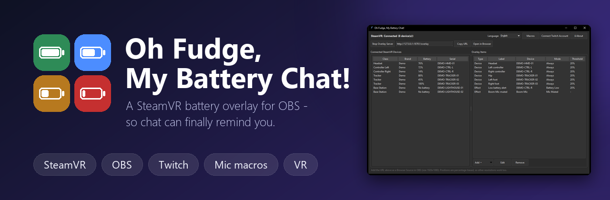
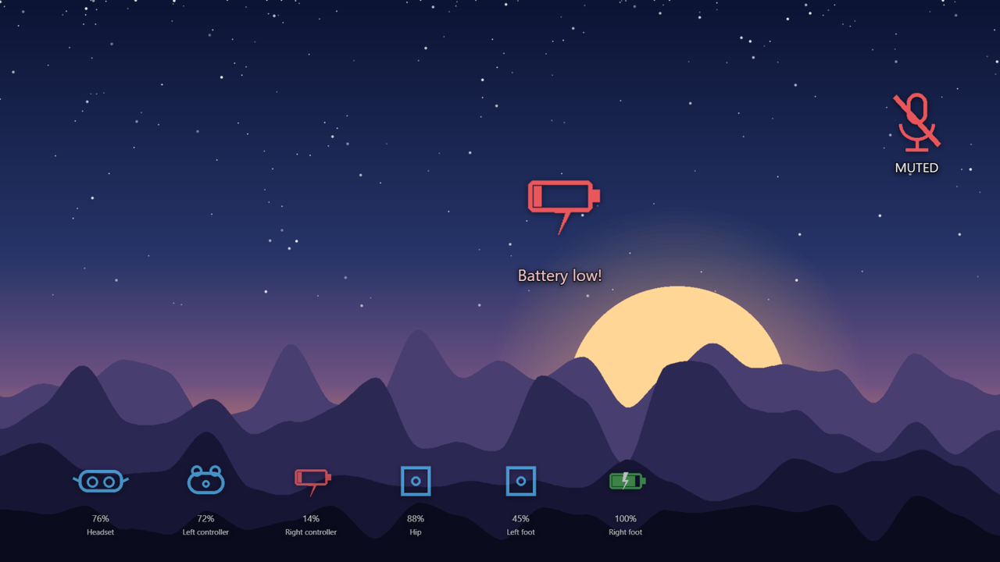
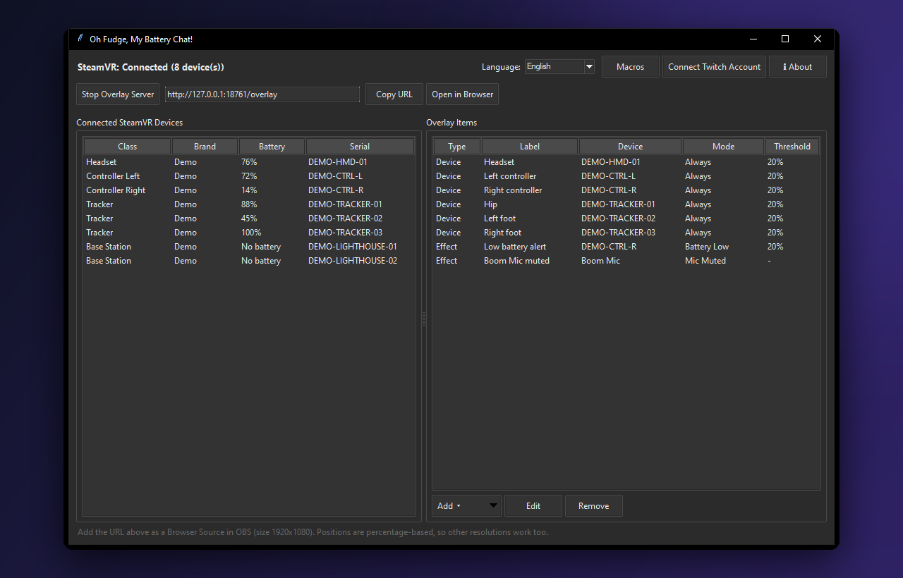
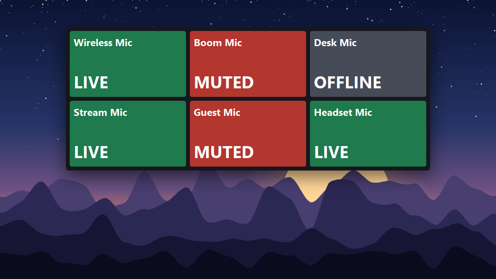

<div align="center">



*Una superposición de batería de SteamVR para OBS - para que el chat por fin te lo recuerde.*

[](https://github.com/Jayconius/OhFudgeMyBatteryChat/releases/latest)
[](#)
[](#)
[](LICENSE)

🌐 [English](README.md) | [Deutsch](README.de.md) | [Français](README.fr.md) | **Español** | [日本語](README.ja.md)

</div>

---

## ✨ ¿Qué es?

Tu casco, tus mandos y tus trackers muestran su **batería en directo en el stream**, y **aparece una alerta** cuando algo se está quedando sin carga. Es una fuente de Navegador de OBS normal: no hay que instalar nada en OBS.

<p align="center"></p>

> [!TIP]
> **¿No haces streaming?** No necesitas OBS. Pulsa **Abrir en el navegador** en la aplicación y úsalo como alarma personal de batería baja.

## 📥 Descarga

| | |
|---|---|
| 💿 **[Oh Fudge, My Battery Chat!](https://github.com/Jayconius/OhFudgeMyBatteryChat/releases/latest)** | La aplicación. Un solo exe, nada que instalar. |
| 🎙️ **[Oh Fudge VR Macro App](https://github.com/Jayconius/OhFudgeMyBatteryChat/releases/tag/macros-v1.0.0)** | Opcional. Botones grandes de silencio en una ventana pequeña que puedes anclar en VR. |
| 🧪 **[Demo Simulator](https://github.com/Jayconius/OhFudgeMyBatteryChat/releases/tag/simulator-v2.0.0)** | Opcional. Dispositivos y micrófonos falsos, para probar sin casco. |

> [!NOTE]
> Los exe no están firmados, así que Windows SmartScreen puede decir *"editor desconocido"*. Pulsa **Más información → Ejecutar de todas formas**.

## 🚀 Inicio rápido

1. **Abre la aplicación** con SteamVR ya abierto. Tus dispositivos aparecen a la izquierda.
2. **Pulsa Añadir** para crear un indicador de batería (*Añadir dispositivo*) o una alerta (*Añadir efecto de superposición*) y arrástralo a su sitio. Haz doble clic en una fila para editarla más tarde.
3. **Copia la URL** de arriba en OBS como **fuente de Navegador** (tamaño 1920x1080). ¡Listo!

<p align="center"></p>

## 🎛️ ¿Qué puede hacer?

| | |
|---|---|
| 🔋 **Batería en directo** | Cualquier dispositivo SteamVR: casco, mandos, trackers. Usa tus propias imágenes, GIF o vídeos - o el paquete de ilustraciones incluido. |
| 🚨 **Alertas de batería baja** | Aparecen cuando baja de tu %, con sonido. Los grupos Nudge alinean varias alertas para que nunca se solapen. |
| ⚡ **Carga** | Una imagen mientras carga y un aviso si sigue bajando aun estando en el cargador. |
| 🎬 **Efectos de superposición** | Ventanas emergentes independientes para: batería baja / normal, dispositivo conectado / desconectado, carga, tracking perdido y casco quitado *(experimental)*. |
| 💜 **Comandos del chat de Twitch** | Deja que el chat dispare una alerta con un comando como `!battery` - para todos, VIP o moderadores. |
| 🎙️ **Micrófonos** *(experimental)* | Alertas para un micrófono inalámbrico: conectado, desconectado, silenciado, hablando, en silencio. |
| 🔘 **Macros de silencio** *(experimental)* | Silencia, activa o alterna un micrófono con un atajo global o un botón grande en pantalla. |
| 🧩 **Grupos de sincronización** | Dispositivos que aparecen juntos, como un conjunto, cuando todos están listos. |
| 🎨 **A tu gusto** | Fuentes, colores, contornos, animaciones (balanceo / sacudida / pulso), tema oscuro o claro. |
| 🌍 **Idiomas** | English, Deutsch, Français, Español, 日本語 y klingon. |

## 🎙️ Macros de silencio y Oh Fudge VR Macro App

*Nuevo (experimental)*

1. Pulsa **Macros** (arriba a la derecha) y luego **Añadir**: elige un micrófono, qué hace la macro (silenciar, activar o alternar) y, si quieres, un **atajo global** como `CTRL+MAYÚS+NUM5`. Funciona aunque un juego tenga el foco.
2. Para botones grandes en pantalla, pulsa **Abrir Oh Fudge VR Macro App** en la misma ventana. Si aún no está en la carpeta de la aplicación, esta ofrece descargarla - solo después de que pulses Sí, y solo se conserva si su suma de verificación coincide con la de GitHub.
3. Cada macro es un botón que muestra **LIVE**, **MUTED** u **OFFLINE**. Empieza bloqueada para que nada se mueva por accidente: **clic derecho > Edit layout** para mover, cambiar el tamaño y el color de los botones, y luego **Done**.
4. Ancla la ventana en VR con **OVR Toolkit, XSOverlay o Desktop+**. Nunca le quita el foco a tu juego.

Las macros cambian el ajuste de silencio de Windows. El botón de silencio de un micrófono inalámbrico normalmente no lo ve Windows: usa una macro (o el silencio de Windows) para que la alerta **Micrófono silenciado** reaccione.

<p align="center"></p>

## 🧪 Prueba sin casco

Consigue el [Simulador de demostración](https://github.com/Jayconius/OhFudgeMyBatteryChat/releases/tag/simulator-v2.0.0) y pon `OhFudgeMyBatteryChatSimulator.exe` en la **misma carpeta** que `OhFudgeMyBatteryChat.exe`. Ejecuta ambos: la aplicación muestra los dispositivos y micrófonos falsos del simulador, cada uno con controles deslizantes y casillas. Cierra el simulador para volver a tus dispositivos reales.

## 📖 Guías prácticas

<details>
<summary><b>Añadir la fuente de Navegador de OBS</b></summary>

<br>

1. En OBS: **Fuentes > + > Navegador**, ponle nombre y acepta.
2. Pega la URL de la parte superior de la aplicación (por defecto `http://127.0.0.1:8710/overlay`).
3. Pon **Ancho** `1920` y **Alto** `1080`. Las posiciones se adaptan a cualquier lienzo, pero los tamaños están calibrados para 1920x1080.
4. Deja desmarcado **"Detener la fuente cuando no sea visible"**, para que las alertas sigan funcionando con la escena fuera de pantalla.
5. ¿Sin sonido? Marca **"Controlar el audio a través de OBS"** en esta fuente.

Una vez añadida, se mantiene sincronizada sola: añadir, editar o quitar algo actualiza la fuente en aproximadamente un segundo.

</details>

<details>
<summary><b>Añadir un dispositivo (un indicador de batería en directo)</b></summary>

<br>

1. Pulsa **Añadir > Añadir dispositivo**.
2. Elige el dispositivo a la izquierda (pulsa **Actualizar** si falta). Marca **"Mostrar dispositivos ya añadidos"** para reutilizar uno.
3. Ponle una etiqueta y un umbral de batería baja (%). Elige **Siempre visible** u **Oculto hasta bajo**.
4. **Imágenes y sonido**: pulsa **Elegir...** para explorar el paquete de ilustraciones incluido, o elige tu propia imagen, GIF o WebM. Lo que omitas usa los valores por defecto.
5. Da estilo al texto, añade una animación y arrástralo a su sitio en la vista previa: se alinea con tus otros elementos.
6. Pulsa **Guardar**.

</details>

<details>
<summary><b>Añadir un efecto de superposición (una alerta independiente)</b></summary>

<br>

1. Pulsa **Añadir > Añadir efecto de superposición**.
2. **Objetivo**: un **dispositivo concreto**, **todos los dispositivos** (la alerta se muestra mientras todos cumplan) o un **dispositivo de audio** (un micrófono de Windows).
3. **Disparador**: elige cuándo aparece, por ejemplo *Batería baja* o *Micrófono silenciado*.
4. Elige imagen y sonido (o los de por defecto) y añade un texto si quieres.
5. Opcional: escribe un **comando de chat** como `!battery` para que el chat de Twitch también pueda dispararla (vincula antes tu cuenta con **Conectar cuenta de Twitch**).
6. Elige la animación, colócala y pulsa **Guardar**.

</details>

## 🔒 Privacidad

- Todo funciona en tu PC. La superposición solo se sirve en `127.0.0.1`.
- La aplicación solo se conecta a Internet cuando tú lo pides: la comprobación de actualizaciones opcional (desactivada por defecto), vincular Twitch (apruebas en la propia página de Twitch; nunca escribes una contraseña en esta aplicación) o descargar una herramienta complementaria opcional después de pulsar Sí.

## ⚠️ Conviene saber

- **Solo Windows**, y SteamVR debe estar abierto para ver dispositivos reales.
- Algunos dispositivos informan de la batería a saltos, así que pueden mostrar **"n/a"** hasta que se reinicien o estén realmente bajos. Es cosa del controlador del dispositivo, no un fallo de esta aplicación.
- Las funciones de micrófono, tracking perdido y casco quitado son nuevas. Están probadas con el Simulador de demostración (y un micrófono inalámbrico); el tracking y la proximidad del casco aún no están confirmados en hardware real - ¡se agradecen los informes!
- Atajos: otro programa que use la misma combinación gana, algunos juegos bloquean los atajos globales, y Bloq Num debe estar activado para las teclas del teclado numérico.

## 🛠️ Compílalo tú mismo

Requiere Python 3.12. Los archivos `.spec` no están en el repositorio, así que usa estos comandos:

```bash
pip install -r requirements.txt
pyinstaller --onefile --windowed --name "OhFudgeMyBatteryChat" --collect-all openvr --collect-all pycaw --collect-all comtypes --add-data "app/fonts;fonts" --add-data "assets;device_icons" main.py
pyinstaller --onefile --windowed --name "OhFudgeVRMacroApp" --paths . tools/vr_macro_app.py
```

## 📄 Licencia

MIT - consulta [LICENSE](LICENSE). La fuente klingon incluida tiene una licencia aparte, la SIL Open Font License (consulta `app/fonts/LICENSE-pIqaD-qolqoS.txt`).

---

<sub>Sin relación con Valve, Meta, Twitch ni OBS. Esos nombres pertenecen a sus dueños.<br>Creado con [Claude](https://claude.com) (Anthropic) mediante programación en pareja conversacional.</sub>
