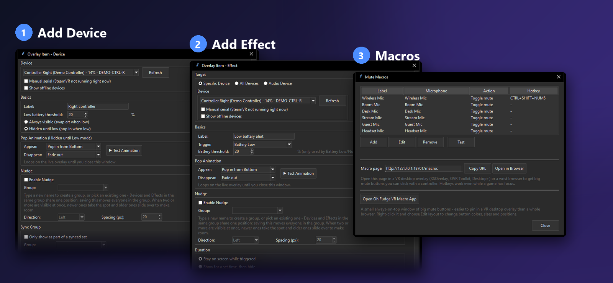

<div align="center">


*OBS向けのSteamVRバッテリーオーバーレイ - チャットがようやく教えてくれます。*

[](https://github.com/Jayconius/OhFudgeMyBatteryChat/releases/latest)
[](#)
[](#)
[](LICENSE)

🌐 [English](README.md) | [Deutsch](README.de.md) | [Français](README.fr.md) | [Español](README.es.md) | **日本語**

</div>

---

## ✨ これは何？

ヘッドセット・コントローラー・トラッカーの**バッテリー残量を配信画面にリアルタイム表示**し、残量が少なくなると**アラートがポップアップ**します。普通のOBSブラウザソースなので、OBSに何かをインストールする必要はありません。

<p align="center"></p>

> [!TIP]
> **配信しない場合は？** OBSは不要です。アプリの **ブラウザで開く** をクリックして、個人用のバッテリー低下アラームとして使えます。

## 📥 ダウンロード

| | |
|---|---|
| 💿 **[Oh Fudge, My Battery Chat!](https://github.com/Jayconius/OhFudgeMyBatteryChat/releases/latest)** | 本体アプリ。exe 1つで、インストール不要。 |
| 🎙️ **[Oh Fudge VR Macro App](https://github.com/Jayconius/OhFudgeMyBatteryChat/releases/tag/macros-v1.0.0)** | オプション。VR内に固定できる小さなウィンドウの大きなミュートボタン。 |
| 🧪 **[Demo Simulator](https://github.com/Jayconius/OhFudgeMyBatteryChat/releases/tag/simulator-v2.0.0)** | オプション。ヘッドセットなしで試せる偽のデバイスとマイク。 |

> [!NOTE]
> exeにはコード署名がないため、Windows SmartScreenが *「不明な発行元」* と表示することがあります。**詳細情報 → 実行** をクリックしてください。

## 🚀 クイックスタート

1. SteamVRを開いた状態で**アプリを起動**します。接続中のデバイスが左側に表示されます。
2. **追加**をクリックして、バッテリー表示（*デバイスを追加*）またはアラート（*オーバーレイ効果を追加*）を作り、好きな位置にドラッグします。あとで行をダブルクリックすると編集できます。
3. 上部の**URLをコピー**して、OBSの**ブラウザソース**（サイズ1920x1080）に貼り付けます。完了です！

<p align="center"></p>

## 🎛️ できること

| | |
|---|---|
| 🔋 **リアルタイムのバッテリー** | ヘッドセット、コントローラー、トラッカーなど、あらゆるSteamVRデバイスに対応。独自の画像・GIF・動画も、同梱のイラスト素材集も使えます。 |
| 🚨 **バッテリー低下アラート** | 設定した%を下回るとサウンド付きでポップイン。Nudge Groupsで複数のアラートを重ならないよう並べられます。 |
| ⚡ **充電** | 充電中は専用の画像を表示し、充電しているのに減り続けている場合は警告します。 |
| 🎬 **オーバーレイ効果** | 単独のポップアップ：バッテリー低下/正常、デバイスの接続/切断、充電、トラッキング喪失、ヘッドセットを外した *(実験的)*。 |
| 💜 **Twitchチャットコマンド** | `!battery` のようなコマンドでチャットからアラートを発動。全員/VIP/モデレーターに限定できます。 |
| 🎙️ **マイク** *(実験的)* | ワイヤレスマイクのアラート：接続、切断、ミュート、発話、無音。 |
| 🔘 **ミュートマクロ** *(実験的)* | グローバルホットキーや画面上の大きなボタンで、マイクをミュート・解除・切り替え。 |
| 🧩 **同期グループ** | すべての準備ができたら、デバイスがセットとして一緒に表示されます。 |
| 🎨 **自分好みに** | フォント、色、縁取り、揺れ/震え/脈動アニメーション、ダーク/ライトテーマ。 |
| 🌍 **対応言語** | English、Deutsch、Français、Español、日本語、クリンゴン語。 |

## 🧰 3つのウィンドウですべて設定

設定はすべて3つのシンプルなウィンドウで行います：**デバイスを追加**（リアルタイムのバッテリー表示）、**オーバーレイ効果を追加**（アラート）、**マクロ**（ミュートボタンとホットキー）。画像をクリックすると拡大できます。画像は英語表示です。

<p align="center"><a href="docs/images/settings.png"></a></p>

## 🎙️ ミュートマクロと Oh Fudge VR Macro App

*新機能（実験的）*

1. 右上の **マクロ** をクリックして **追加**：マイク、マクロの動作（ミュート・解除・切り替え）、必要なら `CTRL+SHIFT+NUM5` のような **グローバルホットキー** を選びます。ゲームがアクティブでも動作します。
2. 画面上の大きなボタンを使うには、同じウィンドウの **Oh Fudge VR Macro Appを開く** をクリックします。アプリのフォルダーにまだない場合は、ダウンロードするか確認されます（「はい」を押した場合のみ。GitHubのチェックサムと一致した場合だけ保存されます）。
3. マクロごとに **LIVE**、**MUTED**、**OFFLINE** を表示するボタンになります。最初はロックされていて、誤って動かすことはありません。**右クリック > Edit layout** でボタンの移動・サイズ変更・色の変更ができ、**Done** で再びロックします。
4. **OVR Toolkit、XSOverlay、Desktop+** などでVR内に固定できます。ゲームのフォーカスを奪うことはありません。

マクロはWindowsのミュート設定を変更します。ワイヤレスマイク本体のミュートボタンは通常Windowsから見えないため、**マイクミュート** のアラートを反応させたい場合はマクロ（またはWindowsのミュート）を使ってください。

<p align="center"></p>

## 🧪 ヘッドセットなしで試す

[デモシミュレーター](https://github.com/Jayconius/OhFudgeMyBatteryChat/releases/tag/simulator-v2.0.0)を入手し、`OhFudgeMyBatteryChatSimulator.exe` を `OhFudgeMyBatteryChat.exe` と**同じフォルダー**に置きます。両方を起動すると、アプリにシミュレーターの偽のデバイスとマイクが表示されます（それぞれスライダーとチェックボックス付き）。シミュレーターを閉じると本物のデバイスに戻ります。

## 📖 使い方ガイド

<details>
<summary><b>OBSブラウザソースを追加する</b></summary>

<br>

1. OBSで **ソース > + > ブラウザ** を選び、名前を付けてOK。
2. アプリ上部に表示されているURL（既定 `http://127.0.0.1:8710/overlay`）を貼り付けます。
3. **幅** `1920`、**高さ** `1080` に設定します。位置はどんなキャンバスにも合いますが、サイズは1920x1080基準です。
4. **「非表示時にソースを停止」** はオフのままにします。シーンが表示されていなくてもアラートが動作します。
5. 音が出ない場合は、このソースの **「OBS経由で音声を制御」** にチェックしてください。

追加後は自動で同期されます。項目を追加・編集・削除すると、約1秒以内にブラウザソースが更新されます。

</details>

<details>
<summary><b>デバイスを追加する（リアルタイムのバッテリー表示）</b></summary>

<br>

1. **追加 > デバイスを追加** をクリックします。
2. 左の一覧からデバイスを選びます（表示されない場合は **更新**）。**「追加済みのデバイスを表示」** で再利用できます。
3. ラベルと低下のしきい値（%）を入力し、**常に表示** か **低下するまで非表示** を選びます。
4. **画像とサウンド**：**選択...** で同梱のイラスト素材集を開くか、独自の画像・GIF・WebMを選びます。省略した項目は既定のものを使います。
5. 文字のスタイルやアニメーションを設定し、プレビュー上でドラッグして配置します。他の項目に吸着して揃います。
6. **保存**をクリックします。

</details>

<details>
<summary><b>オーバーレイ効果を追加する（単独のアラート）</b></summary>

<br>

1. **追加 > オーバーレイ効果を追加** をクリックします。
2. **対象**：**特定のデバイス**、**すべてのデバイス**（すべてが条件を満たす間だけ表示）、または **オーディオデバイス**（Windowsのマイク）。
3. **トリガー**：表示するタイミングを選びます（例：*バッテリー低下*、*マイクミュート*）。
4. 画像とサウンドを選び（既定のままでも可）、必要ならキャプションを追加します。
5. オプション：`!battery` のような **チャットコマンド** を入力すると、Twitchチャットからも発動できます（先に **Twitchアカウントを連携** で連携してください）。
6. アニメーションを選び、位置を決めて **保存** をクリックします。

</details>

## 🔒 プライバシー

- すべてお使いのPC内で動作します。オーバーレイは `127.0.0.1` でのみ提供されます。
- アプリがインターネットに接続するのは、あなたが操作したときだけです：任意の更新確認（既定ではオフ）、Twitchの連携（Twitch自身の承認ページで承認し、このアプリにパスワードを入力することはありません）、または「はい」を押した後の任意の補助ツールのダウンロード。

## ⚠️ 知っておくこと

- **Windows専用**です。実際のデバイスを表示するにはSteamVRを開いておく必要があります。
- 一部のデバイスはバッテリー残量を断続的にしか報告しないため、再起動するか本当に少なくなるまで **「n/a」** と表示されることがあります。これはデバイスのドライバーの仕様で、このアプリの不具合ではありません。
- マイク、トラッキング喪失、ヘッドセットを外した検出は新機能です。デモシミュレーター（とワイヤレスマイク1台）でテスト済みですが、トラッキングとヘッドセットの近接検出は実機ではまだ確認できていません。ご報告をお待ちしています！
- ホットキー：同じ組み合わせを使う他のプログラムが優先され、一部のゲームはグローバルホットキーをブロックします。テンキーを使うにはNumLockをオンにしてください。

## 🛠️ 自分でビルドする

Python 3.12が必要です。`.spec` ファイルはリポジトリに含まれないため、次のコマンドを使います：

```bash
pip install -r requirements.txt
pyinstaller --onefile --windowed --name "OhFudgeMyBatteryChat" --collect-all openvr --collect-all pycaw --collect-all comtypes --add-data "app/fonts;fonts" --add-data "assets;device_icons" main.py
pyinstaller --onefile --windowed --name "OhFudgeVRMacroApp" --paths . tools/vr_macro_app.py
```

## 📄 ライセンス

MIT - [LICENSE](LICENSE) を参照。同梱のクリンゴン語フォントは別ライセンス（SIL Open Font License）です（`app/fonts/LICENSE-pIqaD-qolqoS.txt` を参照）。

---

<sub>Valve、Meta、Twitch、OBSとは無関係です。これらの名称はそれぞれの所有者に帰属します。<br>[Claude](https://claude.com)（Anthropic）との対話型ペアプログラミングで作られました。</sub>
