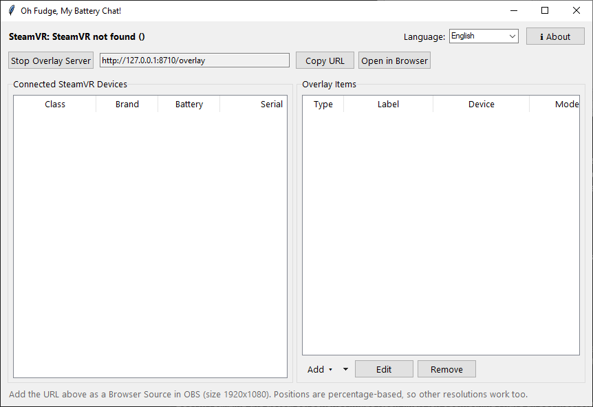

<div align="center">

# Oh Fudge, My Battery Chat!

[](https://github.com/Jayconius/OhFudgeMyBatteryChat/releases/tag/v1.0)
[](#)
[](#)
[](LICENSE)

*A SteamVR battery overlay for OBS - so chat can finally remind you.*



</div>

Shows your headset, controllers, and trackers' battery live on stream, with
pop-in alerts when something's running low - as a normal OBS Browser Source.

## Quick start

1. Grab the exe from [Releases](https://github.com/Jayconius/OhFudgeMyBatteryChat/releases/latest)
   and run it with **SteamVR** already open.
2. Click **Add** to add a device readout or a low-battery alert, then drag
   it into place.
3. Copy the URL shown at the top into OBS as a **Browser Source** (size
   1920x1080).

That's it - no Python or extra installs needed, the exe is self-contained.

## Features

- Live battery % for any SteamVR device, with a low-battery pop-in alert
- Use your own pictures/GIFs/videos and sounds, or the built-in defaults
- Drag-to-position with snap-to-align, plus several pop/fade animations
- Runs in English, Deutsch, Français, Español, 日本語, and Klingon

## Building from source

```bash
pip install -r requirements.txt
pyinstaller --onefile --windowed --name "OhFudgeMyBatteryChat" --collect-all openvr --add-data "app/fonts;fonts" main.py
```

## License

MIT - see [LICENSE](LICENSE). The bundled Klingon font is licensed
separately under the SIL Open Font License (see
`app/fonts/LICENSE-pIqaD-qolqoS.txt`).

---

<sub>Built with [Claude](https://claude.com) (Anthropic) via conversational pair-programming.</sub>
